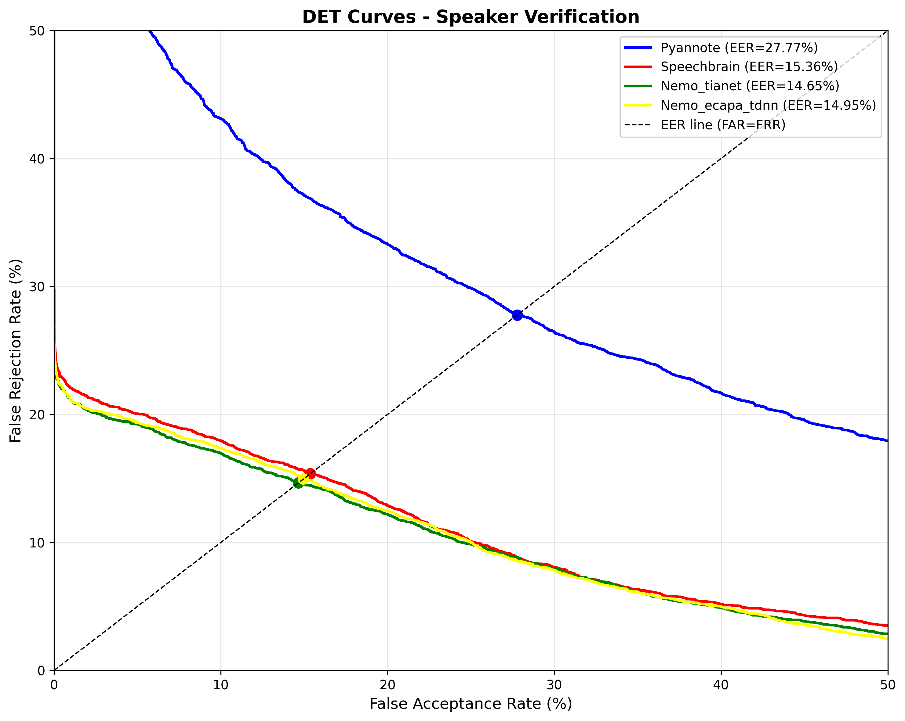

# 1. DET Curve là gì?

DET (Detection Error Tradeoff) plot biểu diễn mối quan hệ giữa:

* **FAR (False Acceptance Rate)** – nhận nhầm người khác là cùng người
* **FRR (False Rejection Rate)** – từ chối nhầm đúng người

Hai trục đều ở thang **log-normal**, giúp nhìn rõ khác biệt nhỏ trong vùng thấp.

Điểm FAR = FRR chính là **EER**.

---

# 2. Nhìn vào đồ thị này thấy gì ngay?

### ✔ Màu đỏ = SpeechBrain ECAPA

→ Luôn nằm **thấp hơn và trái hơn** màu xanh
→ **Tốt hơn trên toàn bộ dải threshold**

### ✔ Màu xanh = Pyannote

→ Luôn cao hơn → sai nhiều hơn → embedding yếu

=> **SpeechBrain vượt trội so với Pyannote trong phân biệt speaker.**

---

# 3. Hai điểm đen (dấu tròn) trên biểu đồ

Hai điểm đen trên mỗi đường cong chính là:

### **Điểm EER (Equal Error Rate)**

* Nơi FAR = FRR
* Threshold tối ưu theo tiêu chuẩn EER

Trong hình:

### 🔵 Pyannote:

* EER ≈ **27.8%**
  → cả FAR và FRR đều rất cao → model phân biệt speaker kém
  → embedding không đủ tách biệt giữa same-speaker và diff-speaker

### 🔴 SpeechBrain:

* EER ≈ **15.36%**
  → tốt gần **gấp đôi** Pyannote
  → embedding tách biệt rõ hơn

Dấu hiệu rõ ràng: điểm EER của màu đỏ **thấp hơn và lệch trái**, nghĩa là:

* FAR thấp hơn
* FRR thấp hơn
* Model mạnh hơn

---

# 4. Đường màu đỏ nằm thấp hơn & trái hơn toàn bộ đường xanh

SpeechBrain có đường cong:

* **Giảm FAR nhanh hơn** khi tăng threshold
* **Tăng FRR chậm hơn**

Điều đó nghĩa là:

### → Score distribution của SpeechBrain separable hơn

* Same-speaker scores cao, tập trung
* Different-speaker scores thấp, tách biệt
* Ít overlap → ROC, DET, PR đều đẹp

Trong khi Pyannote:

* Overlap lớn
* Khi giảm FAR thì FRR tăng mạnh
  → hai tập score dính vào nhau

---

# 5. Ý nghĩa thực tế cho Speaker Diarization

Với kết quả như biểu đồ:

### ✔ SpeechBrain giúp diarization:

* Ít merge (giảm FAR)
* Ít split (giảm FRR)
* Clustering ổn định hơn (AHC / VBx)
* Ngưỡng (threshold) dễ điều chỉnh hơn
* DER sẽ giảm đáng kể

### ✔ Pyannote embedding:

* Merge rất nhiều speaker (FAR cao)
* Split nhiều (FRR cao)
* Thường dẫn tới DER cực cao
* Chỉ phù hợp khi chạy trong **Pyannote pipeline full**
  (vì Pyannote đã tinh chỉnh threshold/PLDA riêng)

---

# 6. Nhìn vào đường nét đứt màu đen (EER line)

Đây là đường “FAR = FRR”.

Điểm giao giữa đường cong và đường nét đứt:

* Cho ngưỡng tối ưu theo EER
* Dễ nhìn thấy SpeechBrain giao ở khoảng FAR ≈ 15%
* Và Pyannote giao ở FAR ≈ 28%