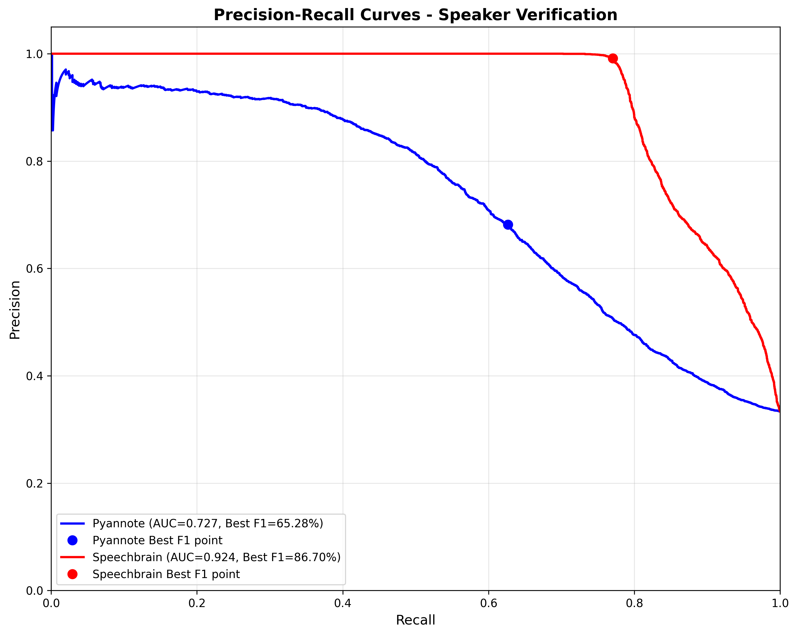

# 1. Ý nghĩa của Precision–Recall Curve

PR curve thể hiện:

* **Precision** = tỉ lệ dự đoán “same speaker” là đúng
* **Recall** = tỉ lệ nhận diện đúng “same speaker” trong tất cả cùng-speaker

PR rất quan trọng khi:

* Bài toán **bất cân bằng** (same-speaker trials < different-speaker trials)
* Muốn đánh giá **FP vs FN** một cách chi tiết
* Quan tâm đến **ngưỡng clustering** trong diarization

---

# 2. Nhìn tổng thể đồ thị

### ✔ Đường màu đỏ (SpeechBrain) **nằm cao, gần sát Precision=1 trong suốt dải Recall 0.0–0.8**

→ embedding **cực kỳ mạnh**, hiếm khi nhận nhầm speaker khác (false accept gần bằng 0).

### ✔ Đường màu xanh (Pyannote) nằm thấp hơn đáng kể

→ phân biệt speaker kém hơn
→ có nhiều false accept và false reject
→ Precision giảm dần nhanh theo Recall

---

# 3. AUC của PR Curve

Đây là diện tích dưới đường Precision–Recall, đặc biệt quan trọng khi:

- dataset bất cân bằng
- số negative (diff-speaker pairs) rất lớn
- positive (same-speaker pairs) ít hơn

PR-AUC phản ánh:

- độ ổn định của precision khi tăng recall

- độ mạnh của embedding trong false accept / false reject

Biểu đồ đã ghi rõ:

* **Pyannote AUC = 0.727**
* **SpeechBrain AUC = 0.924**

→ SpeechBrain vượt trội **~20% absolute**, cực kỳ lớn trong speaker embedding.

---

# 4. Best F1 Point (điểm tối ưu nhất về precision–recall)

Dấu tròn:

### 🔵 Pyannote Best F1:

* F1 = **65.28%**
* Precision = 68.16%
* Recall = 62.64%

Phân tích:

* Precision thấp → nhiều false accept
* Recall thấp → nhiều false reject
* Biểu đồ màu xanh cho thấy điểm tối ưu cũng chỉ vừa đủ dùng

---

### 🔴 SpeechBrain Best F1:

* F1 = **86.70%**
* Precision = **99.14%**
* Recall = 77.03%

Điều này cực kỳ quan trọng:

### ✔ Precision ~ 1.0

→ Khi model nói “same speaker”, **gần như chắc chắn đúng**
→ Đây là đặc tính cực tốt để dùng trong **clustering** (AHC, VBx)

### ✔ Recall 0.77

→ Chấp nhận bỏ sót (split) nhưng không bao giờ ghép nhầm (merge)
→ Điều này phù hợp hoàn toàn với bài toán diarization
(vì merge là lỗi nặng hơn split)

---

# 5. Hành vi hai model qua đồ thị

## 🔵 Pyannote (xanh)

* Precision tụt nhanh khi Recall tăng
* Ở Recall 0.5, precision chỉ ~0.88
* Ở Recall 0.8, precision còn ~0.70
* Đây là dấu hiệu của **score distribution overlap lớn**
  → same-speaker và diff-speaker không tách biệt rõ

---

## 🔴 SpeechBrain (đỏ)

* Giữ Precision ≈ 1 cho đến gần Recall 0.8
* Chỉ bắt đầu giảm sau 0.8

Điều này chứng minh:

### → Score threshold có vùng ổn định rất rộng

```
(tốt cho diarization: threshold không nhạy cảm)  
```

### → Model cực kỳ mạnh ở việc tránh nhầm lẫn hai speaker

### → Chất lượng embedding vượt trội Pyannote

---

# 6. Ý nghĩa thực tiễn cho diarization

### ✔ SpeechBrain embedding (ECAPA):

* Rất ít merge cluster
* Nhiều ngưỡng clustering hoạt động tốt (robust threshold)
* Cosine similarity matrix sạch, có separable margins
* Kết hợp với VBx / AHC sẽ giảm mạnh DER

### ✔ Pyannote embedding:

* Đồ thị cho thấy rất dễ gây merge
* Precision thấp → cộng dồn merge → DER cao
* Chỉ phù hợp khi dùng cả pipeline Pyannote tích hợp (not standalone)
