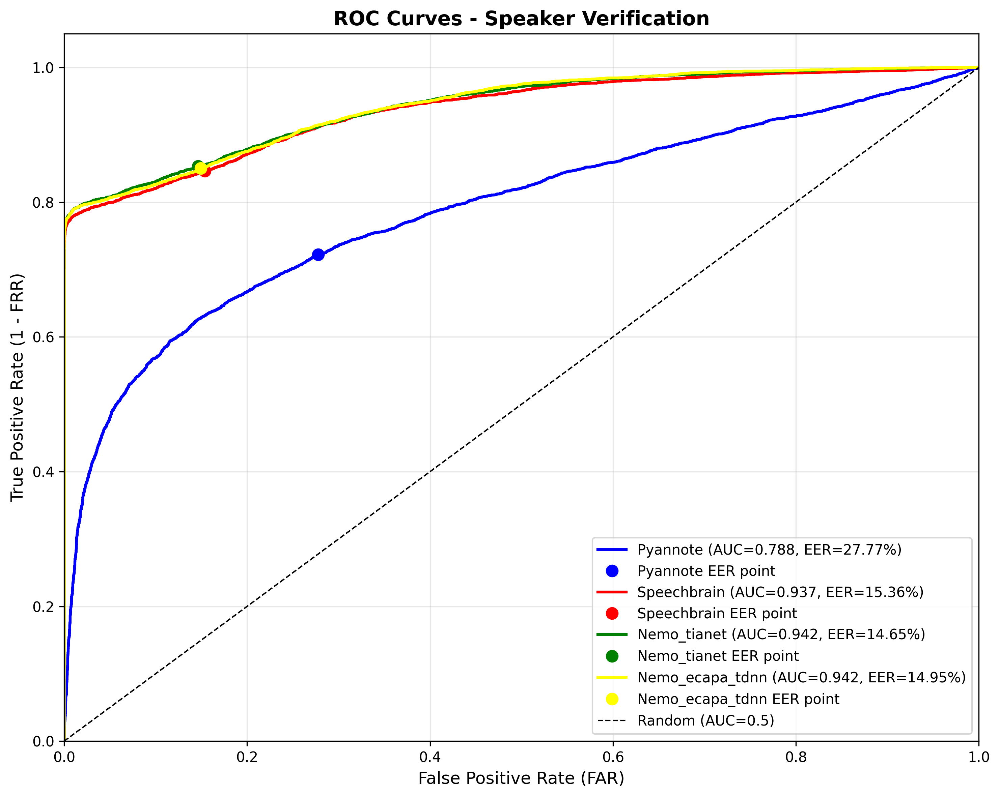

# ✅ 1. ROC Curve là gì ?

* Trục X: **FAR (False Acceptance Rate)**.
* Trục Y: **TPR = 1 − FRR**.
* Đường cong càng ôm góc trái trên → model càng phân biệt tốt.
* Đường chéo đen (AUC = 0.5) là random baseline, mọi đường nằm trên đường này càng xa càng tốt.

✔ AUC:

Đây là diện tích dưới đường ROC curve, đo khả năng phân biệt same-speaker và different-speaker của model.

ROC curve vẽ:

FAR (False Accept Rate)

TPR (True Positive Rate)

- AUC = 1.0 → phân biệt hoàn hảo
- AUC = 0.5 → random (không phân biệt được)
- AUC < 0.5 → tệ hơn random

Ý nghĩa:

- AUC cao → score distribution của two classes (same vs diff) tách biệt tốt
- AUC thấp → score chồng lấn, khó phân loại

---

# ✅ 2. Những gì biểu đồ cho thấy

| Model              | Màu đường | AUC   | EER   | Điểm EER (FAR, TPR)  |
| ------------------ | --------- | ----- | ----- | -------------------- |
| Pyannote           | Xanh lam  | 0.788 | 27.77 | (0.28, ~0.72)        |
| SpeechBrain ECAPA  | Đỏ        | 0.937 | 15.36 | (0.15, ~0.85)        |
| NeMo Titanet       | Xanh lá   | 0.942 | 14.65 | (0.15, ~0.85)        |
| NeMo ECAPA TDNN    | Vàng      | 0.942 | 14.95 | (0.15, ~0.85)        |

* **Ba đường NeMo + SpeechBrain** bám sát nhau phía trên cùng, chứng tỏ cả ba embedding đều rất separable.
* **Đường Pyannote** nằm hẳn phía dưới, cho TPR thấp hơn ở mọi điểm FAR → biểu hiện của embedding yếu.
* Khoảng cách AUC giữa SpeechBrain/NeMo (~0.94) và Pyannote (0.788) là ~0.15 absolute → chênh lệch lớn.

---

# ✅ 3. Giải thích từng đường ROC

### 🟥 SpeechBrain (đỏ)
* Bật lên gần như thẳng đứng tại FAR < 0.05 → chỉ cần threshold hơi cao là TPR đã ~0.8.
* Đường cong áp sát trần đến cuối biểu đồ → giữ TPR >0.95 dù FAR tăng, chứng minh score same/diff cách xa.

### 🟢 NeMo Titanet & 🟡 NeMo ECAPA
* Hai đường này chồng lên nhau gần như hoàn toàn và nằm trên đường đỏ phần lớn khoảng [0, 0.4] FAR.
* Cực trị ở góc trên: TPR chạm 0.99 khi FAR ~0.4 → phù hợp cho verification khó.
* Điểm EER của Titanet (chấm xanh lá) và NeMo ECAPA (chấm vàng) nằm cao nhất trong bốn model.

### 🔵 Pyannote
* Đường cong hơi phẳng, chạy gần đường random tới tận FAR 0.3 → khó đạt TPR >0.8.
* Chấm EER nằm xa góc trái, khẳng định cần FAR rất cao (~0.28) mới kéo được TPR 0.72.

---

# ✅ 4. Ý nghĩa của các điểm EER (chấm tròn)

* Điểm EER nhãn theo màu cho thấy tại **FAR = FRR**.
* Ba model mạnh dừng ở FAR ≈ 0.15 (15%) với TPR ≈ 0.85 → **EER ~15%**.
* Pyannote dừng ở FAR ≈ 0.28 (28%) với TPR ≈ 0.72 → **EER ~28%** (gần gấp đôi lỗi).
* Trên ROC, càng tiến về góc trái trên thì threshold càng an toàn (ít merge, ít split). Các chấm Titanet/NeMo/SpeechBrain nằm gần góc đó hơn rõ rệt.

---

# ✅ 5. Hàm ý thực tế cho diarization / verification

* **Chọn embedding:** ưu tiên Titanet / NeMo ECAPA / SpeechBrain do đường ROC của chúng gần như trùng và vượt xa baseline.
* **Tuning threshold:** vì đường cong dốc, bạn có thể tăng threshold để giữ FAR <10% mà TPR vẫn >80%, điều mà Pyannote không làm được.
* **Pipeline diarization:** matrix similarity từ Titanet/NeMo/SpeechBrain sẽ clean hơn → ít merge/split, DER thấp hơn. Pyannote chỉ nên dùng khi bám theo full pipeline của họ.

---

# 🔍 6. Tóm tắt ngắn gọn

* Đường ROC giúp trực quan hóa vì sao Pyannote thua xa trong `result.log`.
* Sự chồng chéo giữa ba đường NeMo/SpeechBrain cho thấy bạn có nhiều lựa chọn mạnh tương đương, ưu tiên cái phù hợp tài nguyên.
* Khi viết báo cáo, đính kèm hình này + bảng AUC/EER ở trên là đủ để chứng minh lựa chọn embedding.